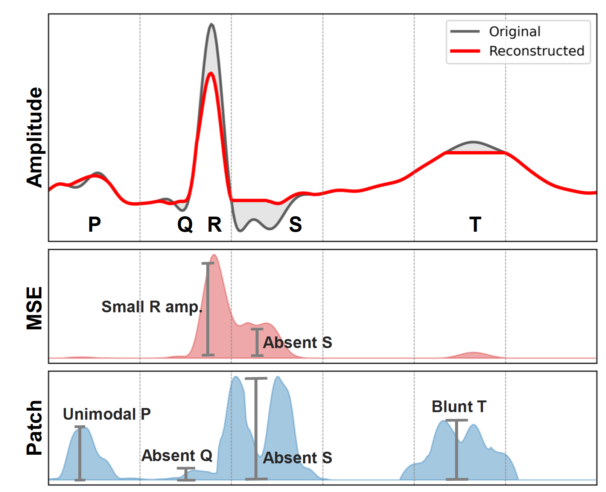
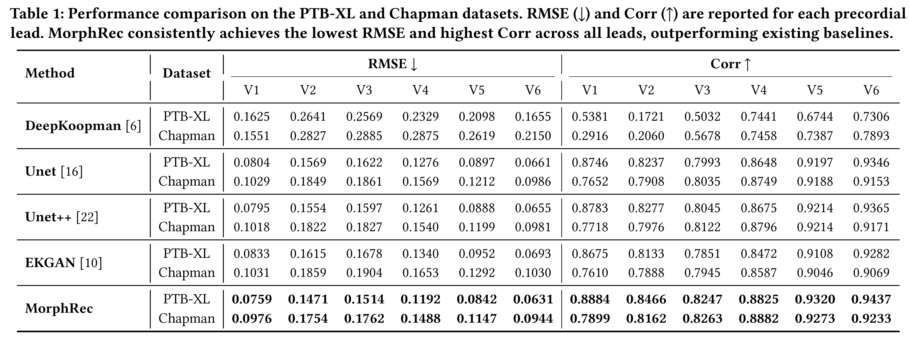

# Morphology-Aware ECG Reconstruction Framework for Missing Precordial Leads in 12-Lead ECGs

[](https://www.python.org/downloads/release/python-3110/)
[](https://pytorch.org/)
[](./LICENSE)

> **Official implementation of "Morphology-Aware ECG Reconstruction Framework for Missing Precordial Leads in 12-Lead ECGs".**


<p align="left">
  
</p>


---

## Table of Contents
- [Environments](#environments)
  - [Requirements](#requirements)
- [Installation](#installation)
  - [Using Docker](#using-docker)
  - [Using Conda](#using-conda)
- [Data Preparation](#data-preparation)
- [How to Run](#how-to-run)
- [Experiments](#experiments)
  - [Hyperparameters](#hyperparameters)
  - [Results](#results)
- [Citation](#citation)
- [Contact](#contact)


---

## Environments
- **Docker**: 27.0.1
- **CPU**: 128-core Intel(R) Xeon(R) Gold 6430
- **GPU**: NVIDIA GeForce RTX 4090 (24GB)
- **NVIDIA Driver**: 560.35.03

### Requirements

- **Python** == 3.11  
- **PyTorch** == 2.6.0  

For a complete list of dependencies, please refer to [`requirements.txt`](requirements.txt).

---

## Installation

### Using Docker

We provide a `Dockerfile` to build the image.  
Simply run the following command to run the container:

```bash
bash build.sh
```

### Using Conda

```bash
conda create -n morphrec python=3.11
conda activate morphrec
conda install pytorch==2.6.0 cudatoolkit=12.6 -c pytorch
git clone <repo-url>
cd MorphRec
pip install -r requirements.txt
```

## How to Run

```bash
python main.py configs/config.yaml
```


---


## Data Preparation

### Dataset Download Instructions

We provide links to publicly available ECG datasets used in our experiments. Please download the raw ECG signal files from the following sources:

- **PTB-XL**  
  [https://physionet.org/content/ptb-xl/1.0.3/](https://physionet.org/content/ptb-xl/1.0.3/)

- **Chapman**  
  [https://physionet.org/content/challenge-2021/1.0.3/training/chapman_shaoxing/#files-panel](https://physionet.org/content/challenge-2021/1.0.3/training/chapman_shaoxing/#files-panel)


### Data Preprocessing

Each ECG signal must be saved as a `.pkl` file with the following dictionary format:

```python
{'I': array([-0.02 , -0.03 , -0.035, ..., -0.02 , -0.035, -0.04 ]),
 'II': array([-0.39 , -0.4  , -0.405, ..., -0.06 , -0.065, -0.07 ]),
 'III': array([-0.37, -0.37, -0.37, ..., -0.04, -0.03, -0.03]),
 'AVR': array([0.205, 0.215, 0.22 , ..., 0.04 , 0.05 , 0.055]),
 'AVF': array([-0.38 , -0.385, -0.385, ..., -0.05 , -0.045, -0.05 ]),
 'AVL': array([ 0.17 ,  0.165,  0.165, ...,  0.005, -0.005, -0.01 ]),
 'V1': array([0.14 , 0.14 , 0.14 , ..., 0.04 , 0.04 , 0.045]),
 'V2': array([0.185, 0.18 , 0.165, ..., 0.055, 0.045, 0.045]),
 'V3': array([ 0.13 ,  0.14 ,  0.13 , ..., -0.06 , -0.065, -0.07 ]),
 'V4': array([ 0.09 ,  0.08 ,  0.065, ..., -0.06 , -0.065, -0.07 ]),
 'V5': array([ 0.17 ,  0.16 ,  0.14 , ..., -0.005, -0.01 , -0.01 ]),
 'V6': array([ 0.155,  0.14 ,  0.135, ..., -0.065, -0.065, -0.065])}
```

⚠️ **Important Note**

Please ensure that all signals are **converted to millivolt (mV) scale**, not microvolt (µV) scale, before processing.


### Data Organization

Please download index of dataset from [here](https://drive.google.com/drive/folders/1mXPmUqj98gHNr42evVeMunGJoaezqra3?usp=share_link), and place files as follows:

```
assets/
configs
src/
dataset/
├── 📁 index/                          # Pickled index files per dataset
│   ├── 📁 chapman/
│   │   ├── 📁 0/                      # Split 0
│   │   │   ├── 📄 train_df.pkl
│   │   │   ├── 📄 valid_df.pkl
│   │   │   └── 📄 test_df.pkl
│   │   ├── 📁 1/                      # Split 1
│   │   │   ├── 📄 train_df.pkl
│   │   │   ├── 📄 valid_df.pkl
│   │   │   └── 📄 test_df.pkl
│   │   ├── 📁 2/                      # Split 2
│   │   │   ├── 📄 train_df.pkl
│   │   │   ├── 📄 valid_df.pkl
│   │   │   └── 📄 test_df.pkl
│   │   ├── 📁 3/                      # Split 3
│   │   │   ├── 📄 train_df.pkl
│   │   │   ├── 📄 valid_df.pkl
│   │   │   └── 📄 test_df.pkl
│   │   └── 📁 4/                      # Split 4
│   │       ├── 📄 train_df.pkl
│   │       ├── 📄 valid_df.pkl
│   │       └── 📄 test_df.pkl
│   │
│   └── 📁 ptb-xl/
│       ├── 📁 0/                      # Split 0
│       │   ├── 📄 train_df.pkl
│       │   ├── 📄 valid_df.pkl
│       │   └── 📄 test_df.pkl
│       ├── 📁 1/                      # Split 1
│       │   ├── 📄 train_df.pkl
│       │   ├── 📄 valid_df.pkl
│       │   └── 📄 test_df.pkl
│       ├── 📁 2/                      # Split 2
│       │   ├── 📄 train_df.pkl
│       │   ├── 📄 valid_df.pkl
│       │   └── 📄 test_df.pkl
│       ├── 📁 3/                      # Split 3
│       │   ├── 📄 train_df.pkl
│       │   ├── 📄 valid_df.pkl
│       │   └── 📄 test_df.pkl
│       └── 📁 4/                      # Split 4
│           ├── 📄 train_df.pkl
│           ├── 📄 valid_df.pkl
│           └── 📄 test_df.pkl
│
├── 📁 chapman/                        # Chapman waveform data
│   └── 📄 *.pkl                       # Waveform pickle files (e.g., MUSE_20180116_120827_04000.pkl)
│
└── 📁 ptb-xl/                         # PTB-XL waveform data
    └── 📄 *.pkl                       # Waveform pickle files (e.g., 00001.pkl)
```


---

## Experiments

### Hyperparameters

The following hyperparameters are explored in the configuration.
You can modify their values in the configuration file at `configs/config.yaml` to experiment with different settings:

| Name         | Values                        |
|--------------|-------------------------------|
| `LAMBDA_GUID`  | `{1, 0.8, 0.4, 0.2, 0.1}`     |
| `LAMBDA_PATCH` | `{1, 0.8, 0.4, 0.2, 0.1}`     |
| `PATCH_SIZE`   | `{25, 50, 75}`                |
| `LR`           | `{1e-4, 2e-4, 4e-4}`          |

---

### Results

<p align="left">
  
</p>

---
